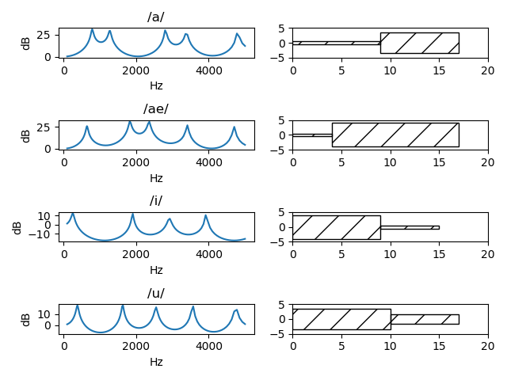
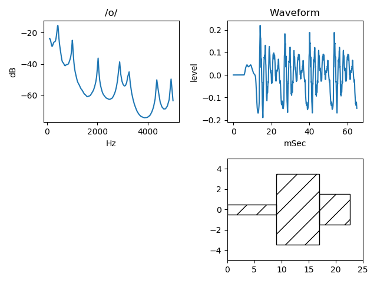
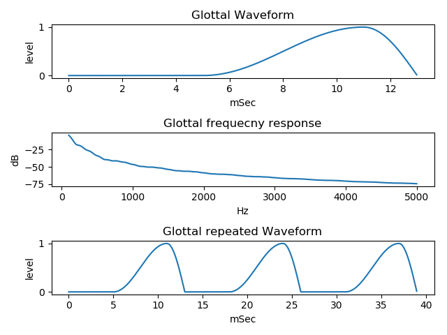
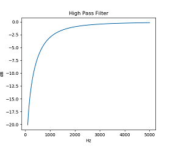

# vocal tract tube model   
   
a very simple model vocal tract, few tube model. generate vowel sound by it.  
A python, draw frequency response and cross-sectional view (area) of a very simple vocal tract model, two tube model and three tube model.  
  
[github repository](https://github.com/shun60s/Vocal-Tube-Model)  

## content    

draw two tube model frequency response and cross-sectional view (area)  
```
python main1.py
```
  

  

draw two tube model frequency response and generated waveform, considering glottal voice source and mouth radiation  
save generated waveform as a wav file  
```
python main2.py
```
  

  

draw three tube model frequency response and generated waveform, considering glottal voice source and mouth radiation, and cross-sectional view (area)  
save generated waveform as a wav file  
```
python main3.py
```
  

  

draw waveform of glottal voice source  
```
python glottal.py
```
  

  

draw frequency response of HPF for simulate mouth radiation  
```
python HPF.py
```
  

## Genarated sample  

There are sample wav files of generated waveform in the generated_waveform folder  

## Document  

See [Explain-E.pdf](docs/Explain-E.pdf) / [Explain-J.pdf](docs/Explain-J.pdf) in the docs folder  
  
  
## Related link      

estimation two tube model parameters from formant  
[github repository](https://github.com/shun60s/Formant2TubeModel)  
  

## License    
MIT  
